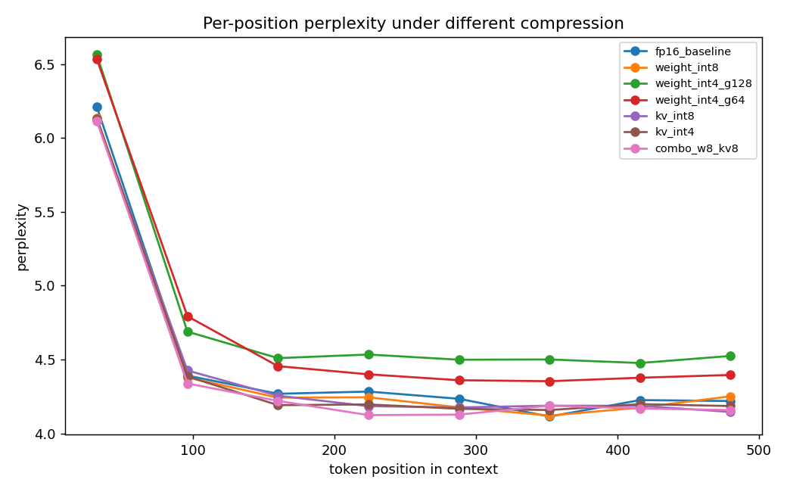

# tiny-llm-quant-ablation

**A small from-scratch LLM, used as a controlled testbed for one question:
when you compress a language model, *which capability breaks first, and is the
break where you'd expect?***

This is not another "I added RoPE to nanoGPT" repo. The architecture
(RoPE + RMSNorm + SwiGLU + GQA + KV-cache, Llama-3 style, ~300 lines) is
deliberately standard. It exists only so that the *ablation* on top of it is
clean and fully understood. The contribution is the experimental design, the
finding — and one prediction I got wrong and what that taught me.

---

## TL;DR finding

On TinyStories, **KV-cache quantization is nearly free — even at INT4 — while
weight INT4 imposes a uniform, global perplexity tax.** Per-position analysis
shows KV quantization causes *no* late-context degradation, contradicting the
intuitive expectation that cached-history errors should accumulate over long
ranges. The most likely cause: this dataset has little genuine long-range
dependency, so the distant KV entries that quantization corrupts are barely
used in the first place.

**The takeaway is not "KV quantization is always free." It's that the cost of
KV quantization depends on how a task actually uses its context — not on the
compression itself.**

| config | perplexity | size (MB) | note |
|---|---|---|---|
| fp16 baseline | 4.367 | 55.6 | reference |
| weight INT8 | 4.388 | 27.8 | essentially lossless, half the size |
| weight INT4 (g=128) | 4.677 | 13.9 | clear, uniform degradation |
| weight INT4 (g=64) | 4.794 | 13.9 | — |
| KV-cache INT8 | 4.423 | 55.6 | near-lossless |
| **KV-cache INT4** | **4.417** | 55.6 | **near-lossless, contradicts my prediction** |
| combo (w8 + kv8) | 4.447 | 27.8 | errors roughly add |



---

## The prediction I made — and got wrong

Before running the ablation I wrote down a bet (this is deliberate: a
prediction made before seeing data is the only honest test of whether you
understand the system).

> **My prediction:** KV-cache INT4 will hurt *late-context* (long-range)
> perplexity the most, because quantization error in cached keys/values should
> accumulate over the history a late token must attend to. Weight quantization,
> applied uniformly to all parameters, should degrade all positions equally.

**Result: the opposite.** Weight INT4 raised perplexity uniformly across all
positions; KV INT4 left late-context perplexity untouched (see figure — the KV
curves hug the fp16 baseline end-to-end, while the weight-INT4 curves sit on a
parallel shelf above it from position ~150 onward).

### Why the prediction failed

The accumulation intuition isn't wrong in general — it just assumes the model
*relies* on distant context. On TinyStories that assumption breaks:

1. **The dataset lacks genuine long-range dependency.** TinyStories are short,
   simple, locally-coherent narratives. Predicting a late token mostly depends
   on the last few dozen words, not on tokens 300+ positions back. If the model
   barely reads distant KV entries, corrupting them to INT4 costs almost
   nothing. This is the dominant explanation.

2. **Per-token KV quantization doesn't accumulate.** Each cached position gets
   its own quantization scale, so errors are independent per position rather
   than compounding along the sequence. Weight-quantization error, by contrast,
   is baked into every forward pass.

The lesson I'd carry forward: *a compression method's cost is a property of the
method × the task, not of the method alone.* To actually stress KV
quantization, you need a task that forces long-range retrieval.

---

## Methodology: why per-position perplexity

A single perplexity number tells you *how much* a model degraded, not *what*
degraded. Bucketing perplexity by token position separates short-range fluency
from long-range dependence — and that separation is exactly what exposed the
prediction failure above. (The average-perplexity table alone would have
misled: KV-INT4's average ppl is actually *lower* than weight-INT4's, hiding
nothing because there was nothing to hide — but the per-position view is what
let me *verify* there was no hidden late-context tax.)

This "look at where it breaks, not just how much" workflow is the same one I
used in my undergraduate thesis on UAV object detection, where aggregate mAP
hid which object *classes* compression actually hurt.

## A second, smaller surprise

INT4 with group size 64 scored slightly *worse* on average perplexity than
g=128 (4.794 vs 4.677), which is counter-intuitive — finer grouping should
quantize more precisely. In the per-position view the g=64 curve actually sits
slightly *below* g=128, so the averaged number is the misleading one here. Part
of this is an implementation detail: layers whose input dim isn't divisible by
the group size fall back to per-channel quantization (see `quant.py`), so the
two configs aren't applying grouping to an identical set of layers. Worth a
cleaner controlled re-run; left as a note rather than a claim.

## Architecture (`tllm/model.py`)

| component | choice |
|---|---|
| positional encoding | RoPE |
| normalization | RMSNorm (pre-norm) |
| MLP | SwiGLU (2/3 · 4d hidden) |
| attention | Grouped-Query Attention + KV-cache |
| tied embeddings | yes |

Config used here: 8 layers, d=512, 8 heads / 4 KV heads, context 512 — about
23.6M non-embedding params. Trained on TinyStories on a single Colab L4 in ~40
minutes; the model generates coherent short stories (sample below).

```
Once upon a time, there was a little girl named Lily. She loved to play
outside with her friends. One day, while they were playing, Lily's friend
Tommy said, "But you need a bath. You'll feel clean after you play."
```

## Ablation axes (`tllm/quant.py`)

- **Weight quantization** — INT8 per-channel, INT4 grouped (g=128 / g=64),
  simulated (quant→dequant) to isolate the *accuracy* effect of precision loss.
- **KV-cache quantization** — INT8 / INT4, per-token, applied to keys/values as
  they enter the cache.
- **Combination** — weight-INT8 + KV-INT8.

## Reproduce

```bash
# 1. data: download TinyStories, train tokenizer, tokenize to memmap
python -m scripts.prepare_data --out_dir data --vocab_size 8192

# 2. train (auto-resumes; checkpoints to ckpt_dir)
python -m scripts.train --data_dir data --ckpt_dir ckpt --max_iters 20000

# 3. ablation grid -> results.json + ppl_by_position.png
python -m scripts.run_ablation --ckpt_dir ckpt --data_dir data
```

### Colab note

Mount Drive as cold storage only. Copy checkpoint + data to local `/content`
before training/eval and write results back to Drive at the end — Drive's
filesystem drops connections under sustained I/O (`Transport endpoint is not
connected`), which will kill a long run mid-way.

## Project structure

```
tllm/
  model.py     # RoPE / RMSNorm / SwiGLU / GQA / KV-cache transformer
  quant.py     # weight + KV-cache quantization
  eval.py      # perplexity, per-position perplexity, latency/memory
scripts/
  prepare_data.py   # TinyStories -> tokenizer -> memmap
  train.py          # training loop w/ checkpointing + resume
  run_ablation.py   # the experiment grid -> results.json + plot
```

## Limitations & honesty

- Weight quantization is **simulated** (quant→dequant in fp). This measures the
  *accuracy* cost of low precision; it does not produce a packed INT4 kernel or
  wall-clock speedup. That's the right tool for a *sensitivity* study — speedup
  is a separate, hardware-dependent question.
- The model was trained for 20k steps; validation perplexity bottomed out
  around step 12k (ppl ≈ 4.08) and drifted up slightly afterward, so the
  checkpoint used here (ppl ≈ 4.37) is not the global best. Absolute baseline
  differs by a small constant; it doesn't change the relative ablation
  conclusions, which is what this study is about.
- TinyStories is a simple, short-context domain. The central finding — that KV
  quantization is cheap *when long-range dependency is absent* — is a claim
  about this regime, not about frontier models. The methodology transfers; the
  numbers don't.

## Future work

The clean follow-up is to re-run the same ablation on a task that *forces*
long-range retrieval (e.g. a synthetic copy/lookup task, or a dataset with
genuine document-level dependencies). The prediction above should hold *there*:
KV-INT4 late-context perplexity should finally diverge from baseline. That
experiment would turn "KV quantization is free here" into "here is exactly the
context-utilization threshold where KV quantization starts to cost."

## License

MIT
